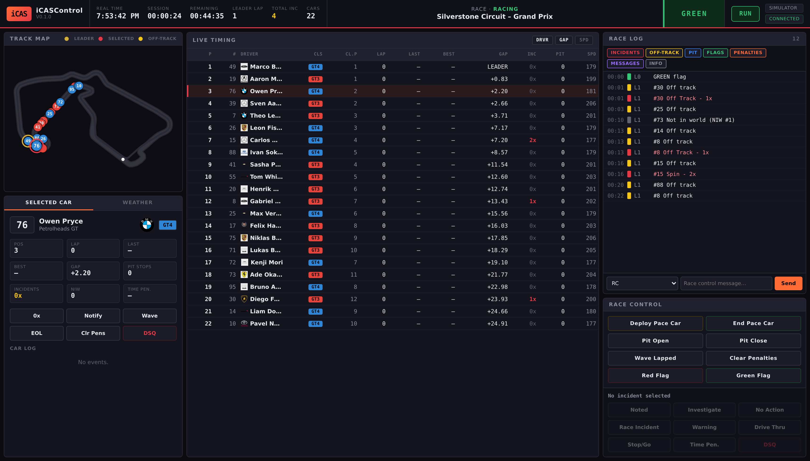

# iCASControl

A race control / stewarding tool for iRacing leagues, modelled on the
[iRaceControl](https://iracecontrol.com/) software. It connects to a running
copy of iRacing, shows live timing, an animated track map and a full incident
log, and gives a race director the tools to manage a race.

This is **version 0.1** — a working foundation. The core race-control loop is
built and runs, with real circuit maps for 200+ tracks and the ability to
replay recorded races; the larger automation features (Sequencer, Auto Steward,
exports, networking) are planned in [`ROADMAP.md`](ROADMAP.md).



## Three ways to run

The application is built around a swappable *data source*, so it behaves
identically whether the race data is live, simulated or recorded:

**Simulator mode** runs a complete, believable GT3 + GT4 race entirely inside
the app — no iRacing needed. It runs on the real Silverstone circuit and works
on any computer (Windows, Mac, Linux), ideal for learning the interface,
developing new features and recording videos.

**iRacing mode** reads live telemetry from a running copy of iRacing through
its SDK, and draws the real circuit map (200+ tracks bundled). Windows only,
with iRacing running.

**Replay mode** plays back a previously recorded race from a `.jsonl` log —
useful for reviewing incidents after the event, for demos, and for testing.

When you start the app it tries iRacing first; if iRacing is not running it
falls back to the simulator automatically. If you start iRacing later, the app
notices within a few seconds and switches over to the live data on its own.

## Quick start

You need **Python 3.10 or newer** installed.

On **Windows** (your iRacing PC), just double-click **`run_windows.bat`**. The
first run creates a small Python environment and installs everything — that
takes a minute or two. Every run after that starts in a few seconds. When it
is running, open **http://localhost:8080** in your browser.

On **macOS / Linux**, open a terminal in this folder and run `bash run.sh`,
then open the same address. (These platforms always use the simulator.)

To force the simulator even on your iRacing PC, run from a terminal:

```
python -m backend.server --sim
```

## Replaying a recorded race

To play back a recorded race instead of going live, point the app at a
`.jsonl` log file. A few sample races are bundled in the `logs/` folder:

```
python -m backend.server --replay logs/20260519-195232_suzuka_international_racing_course_grand_prix_race.jsonl
```

Add `--replay-speed 4` to play it back at 4× speed. The dashboard behaves
exactly as in a live race — the timing, track map and incident log all update —
so a steward can review a finished race, scrub through the incidents and see
exactly what happened. (These logs come from the companion race-logger; the
roadmap covers recording iCASControl's own races.)

## Setting up iRacing

For iRaceControl-style tools to see every car, iRacing has to be told to
request data for the whole field. In iRacing, go to **Options → Graphics** and
set **Max Cars** to **63**. Run iRacing and this app both *without*
administrator rights (or both *with* — just keep them the same).

## Using the dashboard

The header along the top shows the clocks, the incident counter, the session
type and state, the current flag, and a **RUN / STOP** toggle (STOP pauses data
collection so you can review without new data coming in).

The **track map** on the left animates every car as a numbered roundel in its
class colour. The car you have selected gets a red ring, the leader a gold one,
and any car off-track is highlighted in yellow.

The **live timing** table in the centre lists every car with position, lap,
last/best lap, gap or interval, incident count, pit stops and speed. The small
toggles in its header switch driver/team names, gap/interval and the speed
column. Click a row to select that car; double-click to (in iRacing) jump the
camera to it.

The **race log** on the right records every incident, off-track, pit stop, flag
and penalty. The filter buttons hide categories you do not need. Click an
incident to select it, then use the **incident action** buttons below the
command panel to record a decision (Noted, Investigating, No Action, Race
Incident, Drive Through, Stop/Go, Time Penalty, DSQ).

The **race control** buttons issue commands — deploy/end the pace car, open or
close the pit lane, wave lapped cars, post red/green flags. The **selected car**
panel (bottom left) shows that car's detail and per-car actions (0x, notify,
wave-around, end-of-line, DSQ).

## What works today vs. what is honest to flag

Live timing, the real track map, the incident/event log, gaps and intervals,
pit detection, NIW counting, flag handling, manufacturer logos, the steward
decision workflow and all race-control commands work fully **in simulator and
replay mode** — that is what the screenshot above shows.

For **live iRacing**, the timing, positions, surfaces, flags, weather and the
circuit map are read straight from the SDK and should be accurate. Two things
are deliberately honest limitations of this version, both explained in the
roadmap:

* iRacing's SDK does not expose a per-car incident *count* for other cars, so
  in iRacing mode the log records off-track excursions and the steward assigns
  points/penalties manually. Behavioural incident detection is planned.
* iRacing's SDK has no broadcast message for admin actions (full-course yellow,
  black flags, pit open/close). For those, the app shows the iRacing chat
  command to use; automating delivery is planned.

These are testable and tunable on your Windows rig — the simulator let the
whole interface be built and verified without a live session.

## Project structure

```
backend/
  server.py              FastAPI server, race loop, WebSocket streaming
  race_state.py          source-independent race engine (log, incidents, penalties)
  models.py              shared data structures
  tracks.py              loads + projects the bundled circuit geometry
  car_brands.py          car-manufacturer detection + logo resolution
  sources/
    base.py              the DataSource interface
    simulator.py         the built-in race simulator
    iracing_source.py    the live iRacing SDK bridge (pyirsdk)
    replay_source.py     plays back a recorded .jsonl race log
frontend/
  index.html             the dashboard
  style.css              dark race-control theme
  app.js                 dashboard logic + WebSocket client
  trackmap.js            animated canvas track map
  brands/                manufacturer logo SVGs
assets/tracks/           200+ bundled circuit geometry files (+ NOTICE.txt)
logs/                    sample recorded races for replay mode
run_windows.bat          one-click launcher for Windows
run.sh                   launcher for macOS / Linux
requirements.txt         Python dependencies
ROADMAP.md               planned features toward full iRaceControl parity
```

## Notes

The app runs entirely on your own machine. The dashboard is served locally and
nothing is sent anywhere. To use it on a second screen, tablet or a co-steward's
laptop on the same network, start it with `python -m backend.server --host
0.0.0.0` and open `http://<your-pc-ip>:8080` from the other device.

## Credits

Circuit geometry in `assets/tracks/` is derived from the
[SIMRacingApps](https://github.com/SIMRacingApps/SIMRacingAppsServer) project by
Jeffrey Gilliam, licensed Apache-2.0 — see `assets/tracks/NOTICE.txt`. The track
files, manufacturer logos and sample race logs were carried over from Thomas's
companion iRacing broadcast-overlay project.
